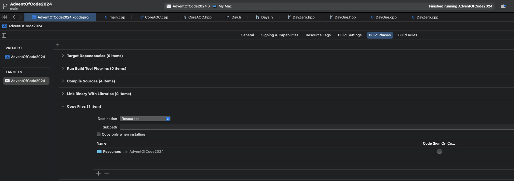

# Advent of Code 2024

## Solution Platform & Selector

Adjust selectors in `main.cpp` to execute specific day/question as:
```
int main(int argc, const char * argv[]) {
    // Main Selection
    CoreAOC::AdventDay daySelector = CoreAOC::AdventDayOne;
    int sectionSelector = 1;

	// Read-out and execution code follows…
}
```

## Day Properties

Individual day's solutions are derived as child classes from the [Day](./Day.h) class, which each day comprising:
* private scope:
	* string : `inputPath`
* public scope:
	* getter method : `GetInputPath()` -> returns inputPath string
	* abstract method : `CrunchPartOne(string& input)`
	* abstract method :`CrunchPartTwo(string& input)`

# Input Read-Out for Day Crunching

Core methods to read each day's problem text are defined in [CoreAOC](./CoreAOC.hpp).  These include:
* `AdventDay` - Enum selector to select the Advent Day problem
* `GetAdventDayInput(string const& inputPath)` -> returns string : Read-out text input for the day's problem, based on inputPath
* `GetDaySelectors(AdventDay adventDay)` -> returns Day : Generate the relevant Day() child class based on AdventDay Enum selector

## Adding New Days

The process for adding new day problems is as follows:
1. Add the day's input text into [Resources](./Resources/)
2. Create a new DayXYZ folder (e.g. [Day1](./Day1/))
	* Generate a new README for the day
	* Generate new DayXYZ .hpp/.cpp files, with the DayXYZ class derived from Day
	* Include the path to the day's input test in resources under the string inputPath
3. Add a new enum to the AdventDay enum in [CoreAOC.hpp](./CoreAOC.hpp)
4. Add an include for the new day class in [Days](./Days.h)
5. Update GetDaySelectors() switch statement to return the relevant Day in [CoreAOC.cpp](./CoreAOC.cpp)


## NOTE: ON COMPILING

If you are building a new XCode project from scratch, you must ensure that the Resources folder is copied over in Build Phases under Project Settings -> Targets, as below:



